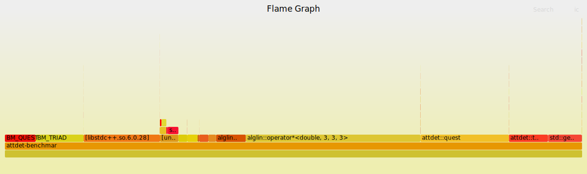

<h1 align="center" style="color:white; background-color:black">Attitude Determination</h1>
<h4 align="center">Library of Deterministic Methods of Attitude Determination</h4>

<p align="center">
	<a href="http://zenith.eesc.usp.br/">
    
    </a>
    <a href="https://eesc.usp.br/">
    
    </a>
    <a href="https://github.com/zenitheesc/AttitudeDetermination/blob/main/LICENSE">
    
    </a>
    <a href="https://github.com/zenitheesc/AttitudeDetermination/issues">
    
    </a>
    <a href="https://github.com/zenitheesc/AttitudeDetermination/commits/main">
    
    </a>
    <a href="https://github.com/zenitheesc/AttitudeDetermination/graphs/contributors">
    
    </a>
    <a href="https://github.com/zenitheesc/AttitudeDetermination/commits/main">
    
    </a>
    <a href="https://github.com/zenitheesc/AttitudeDetermination/issues">
    
    </a>
    <a href="https://github.com/zenitheesc/AttitudeDetermination/pulls">
    
    </a>
</p>

<p align="center">
    <a href="#contents">Contents</a> •
    <a href="#environment-and-tools">Environment and Tools</a> •
    <a href="#steps-to-run-and-debug">Steps to run and debug</a> •
    <a href="#todo">TODO</a> •
    <a href="#how-to-contribute">How to contribute?</a> •
    <a href="#benchmarks">Benchmarks</a> •
    <a href="#more">More</a> 

</p>

## Demo 
<p align="center">
    

</p>
<p align="center">
3D visualization of attitude using the WebSockets and <a href="https://github.com/mrdoob/three.js">THREE.js</a>
</p>

## Contents
-   **attdet** - The main Attitude Determination Library.
-   **attdet/benchmark** - A micro-benchmark of QUEST implementation.
-   **attdet/alglin** - Internal Linear Algebra Library.
-   **examples/quest** - QUaternion ESTimator algorithm demo.
-   **examples/serial** - QUEST demo with serial port data.
-   **examples/websockets** - Pipes: Serial -> QUEST -> WebSocket.
-   **misc** - Python implementation using Numpy

## Environment and tools

CMake. A C++11 Compiler (e.g. GCC 4.8). 
Some targets have specific dependencies:
 - **Tests**: [Catch2](https://github.com/catchorg/Catch2/) (Automatic)
 - **Benchmark**: [Google Benchmark](https://github.com/google/benchmark) (Automatic)
 - **WebSocket**: [POCO++](https://github.com/pocoproject/poco/) (Manual)

All demos were compiled in Linux.
## Steps to run and debug

Both libraries make use of ~~`std::array`~~ e `std::initializer_list`, so a C++11 compiler is necessary. To use `constexpr` modify `attdet/alglin/CMakeLists.txt` changing `gnu++11` to 17. Then use CMake:

```shell
mkdir build
cd build
cmake ..
cmake --build .. --config <CONFIG> --target <TARGET>
```

Where `CONFIG` can be `Debug`, `Release`, `MinSizeRel` and `TARGET` is A subproject: `attdet`, `quest`, `serial` or tests: `alglin-tests`, `attdet-tests`. The tests use the Catch2 library that is automatically fetched by CMake.

The `alglin` library is header-only so its not a direct target. But the `attdet` library is a static library.

## TODO:

-   [x] Compile using STM32 Toolchain (impact\*: ~6KB)
-   [ ] Use asserts in critical functions.
<!-- - [ ] STL Compatible Iterators
-   [ ] `void_t` SFINAE Concepts ? -->

\*Compiling in Release mode, with C++14 manually copying files directly, not compiling and linking `libattdet.a`.

## How to contribute

1.  Fork.
2.  Branch.
3.  Commit.
4.  Pull Request.


## Benchmarks

A visual representation of the execution time of each function in the algorithm. Note that the x axis does not inform the sequence of execution it is [ordered alphabetically](http://www.brendangregg.com/flamegraphs.html).

~~As you can see~~ I need to work on the adjugate function. It does not use the usual algorithm - that uses the inverse - since I found one case where unusual, but valid, data produced a uninvertable matrix. I'll reconsider taking in to account the performance hit.

(Update) - Changed `cofactor` function. Got around a 2.5x improvement. Matrix Multiplication is now the main optimization target.
But I since added the TRIAD benchmark and the speed difference seems to be
around 10x. I knew it would be around a 4x difference. ~~But it seems that I still could shave off some 2x improvement~~.

## More:

Temos um texto sobre Determinação de Atitude e a história do algorítmo QUEST em nosso [Blog](https://zenith-eesc.medium.com/determina%C3%A7%C3%A3o-de-atitude-62d5e716631a)

---

<p align="center">
    <a href="http://zenith.eesc.usp.br">
    
    </a> 
    <a href="https://www.facebook.com/zenitheesc">
    
    </a> 
    <a href="https://www.instagram.com/zenith_eesc/">
    
    </a>

</p>
<p align = "center">
<a href="zenith.eesc@gmail.com">zenith.eesc@gmail.com</a>
</p>
